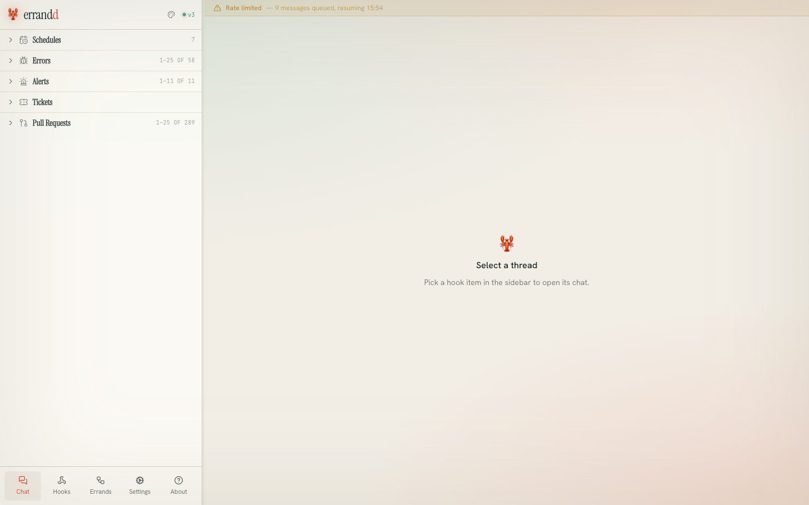
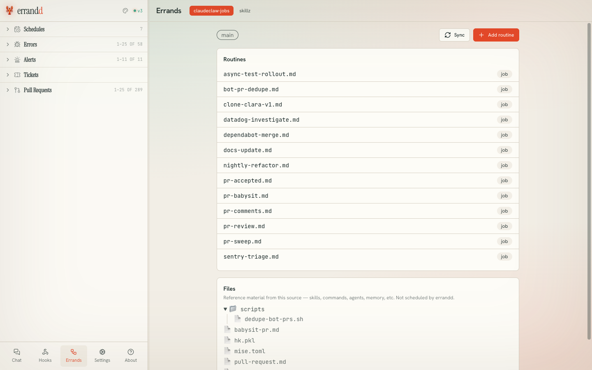
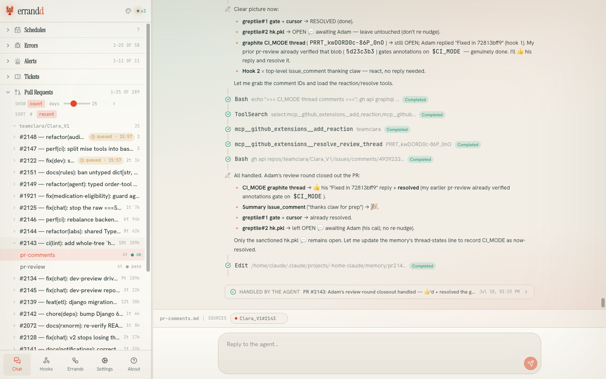

<h1 align="center">errandd</h1>

<p align="center">
  <a href="https://github.com/NorthIsUp/errandd/stargazers">
    
  </a>
  <a href="https://github.com/NorthIsUp/errandd/commits/master">
    
  </a>
  <a href="https://github.com/NorthIsUp/errandd/graphs/contributors">
    
  </a>
</p>

<p align="center"><b>A lightweight, self-hosted daemon that turns your coding-agent CLI into a personal assistant that never sleeps.</b></p>

Errandd runs a coding-agent CLI — **Claude Code** by default, or [**Pi**](https://pi.dev) — as a background daemon: it executes tasks on a schedule, relays chat on Telegram, Discord, and Slack, transcribes voice messages, and ships a real-time web dashboard. It's the open-source alternative to OpenClaw that's built into the coding-agent subscription you already pay for. _(Formerly known as clawdcode.)_

> Note: Please don't use Errandd for hacking any bank system or doing any illegal activities. Thank you.

## Why Errandd?

| Category | Errandd | OpenClaw |
| --- | --- | --- |
| Anthropic Will Come After You | No | Yes |
| API Overhead | Directly uses your Claude Code subscription | Nightmare |
| Setup & Installation | ~5 minutes | Nightmare |
| Deployment | Install Claude Code on any device or VPS and run | Nightmare |
| Isolation Model | Folder-based and isolated as needed | Global by default (security nightmare) |
| Reliability | Simple reliable system for agents | Bugs nightmare |
| Feature Scope | Lightweight features you actually use | 600k+ LOC nightmare |
| Security | Average Claude Code usage | Nightmare |
| Cost Efficiency | Efficient usage | Nightmare |
| Memory | Uses Claude internal memory system + `CLAUDE.md` | Nightmare |

## Getting Started in 5 Minutes

```bash
claude plugin marketplace add NorthIsUp/errandd
claude plugin install errandd
```

Then open a Claude Code session and run:

```
/errandd:start
```

The setup wizard walks you through model, heartbeat, Telegram, Discord, Slack, and security, then your daemon is live with a web dashboard.

## Pluggable runtimes

Errandd doesn't hard-wire itself to a single coding-agent CLI. The exec runtime — the process that actually runs your prompts — sits behind one interface and is chosen once at startup:

- **Claude Code** (`claude`) — the default, byte-identical to how Errandd has always run. Session resume, context-token reporting (which drives size-based auto-compaction), jobs-repo plugins/skills, and MCP server management all work as before.
- **Pi** ([`pi`](https://pi.dev), experimental) — an alternate coding-agent CLI. Errandd drives it with `--mode json -p`, resumes via `--session <id>`, and reads token usage from each message, so auto-compaction works the same as it does for Claude. Pi documents *"No MCP"* by design, so MCP registration is inert, and jobs-repo plugin flags (which are Claude-shaped) aren't forwarded — features a runtime can't back switch off gracefully instead of breaking.

Select the runtime with the `runtime` field in `.claude/errandd/settings.json` or the `ERRANDD_RUNTIME` env var (env wins over the file, like every other setting). Valid values are `claude` (default) and `pi`; an unknown value logs a warning and falls back to Claude Code.

```json
{ "runtime": "pi" }
```

```bash
ERRANDD_RUNTIME=pi
```

Both binaries ship in the Docker image, so **switching runtime is a redeploy/restart, not a rebuild**:

```bash
ERRANDD_RUNTIME=pi docker run ... errandd            # Docker
helm upgrade errandd errandd/charts/errandd --set runtime=pi  # Helm
```

Locally, `mise install` provides a pinned `pi` alongside the rest of the tooling.

> Pi's version is **pinned to 0.80.6** (in both `mise.toml` and the `Dockerfile`) because it's a wire-format dependency: the stream parser is written against the JSON event schema pi 0.80.6 emits. Bump it deliberately and re-run the e2e suite, which fails if the wire moved.

The runtime adapters are covered two ways: a conformance matrix that asserts both runtimes normalize to *identical* events, and an opt-in suite that drives the real binaries:

```bash
cd errandd   # all implementation + tooling lives here
ERRANDD_E2E=1 bun test app/__tests__/runtime-e2e.test.ts
```

## Features

### Automation
- **Heartbeat:** Periodic check-ins with configurable intervals, quiet hours, and editable prompts.
- **Cron Jobs:** Timezone-aware schedules for repeating or one-time tasks with reliable execution.

### Communication
- **Telegram:** Text, image, and voice support.
- **Discord:** DMs, server mentions/replies, slash commands, voice messages, and image attachments.
- **Slack:** Socket Mode bot — DMs, channel mentions, threads, voice messages, and file attachments. Configure `SLACK_BOT_TOKEN` and `SLACK_APP_TOKEN` in your environment or `settings.json`.
- **Time Awareness:** Message time prefixes help the agent understand delays and daily patterns.

### Multi-Session Threads (Discord)
- **Independent Thread Sessions:** Each Discord thread gets its own agent session, fully isolated from the main channel.
- **Parallel Processing:** Thread conversations run concurrently — messages in different threads don't block each other.
- **Auto-Create:** First message in a new thread automatically bootstraps a fresh session. No setup needed.
- **Session Cleanup:** Thread sessions are automatically cleaned up when threads are deleted or archived.
- **Backward Compatible:** DMs and main channel messages continue using the global session.

See [errandd/docs/MULTI_SESSION.md](errandd/docs/MULTI_SESSION.md) for technical details.

### Reliability and Control
- **GLM Fallback:** Automatically continue with GLM models if your primary limit is reached.
- **Web Dashboard:** Manage jobs, monitor runs, and inspect logs in real time.
- **Security Levels:** Four access levels from read-only to full system access.
- **Model Selection:** Switch models based on your workload.

## AG-UI endpoint

`POST /api/agui` runs the selected runtime and streams the turn as [AG-UI](https://ag-ui.com) events over SSE: `RUN_STARTED` → `TEXT_MESSAGE_*` / `TOOL_CALL_*` → `RUN_FINISHED` (or `RUN_ERROR` on failure). It's runtime-agnostic — the same endpoint works whether `ERRANDD_RUNTIME` is `claude` or `pi`.

The body is either an AG-UI `RunAgentInput` (`{ "messages": [...] }`, last user turn is the prompt) or a plain `{ "prompt": "..." }`. Like the rest of the API, it requires the web auth token (`Authorization: Bearer <token>` or `?token=`):

```bash
curl -N -X POST http://localhost:4632/api/agui \
  -H "Authorization: Bearer $(cat .claude/errandd/web.token)" \
  -H "Content-Type: application/json" \
  -d '{"prompt": "summarize the failed runs from today"}'
```

## Configuration & environment overrides

`.claude/errandd/settings.json` is the source of truth for all Errandd config. Every field can be overridden by an `ERRANDD_*` environment variable — env always wins over the file. See `.env.example` for the full list with defaults and descriptions.

| Variable | Overrides |
| --- | --- |
| `ERRANDD_RUNTIME` | Exec runtime: `claude` (default) or `pi` |
| `ERRANDD_MODEL` / `ERRANDD_API` | Primary model and API |
| `ERRANDD_FALLBACK_MODEL` / `ERRANDD_FALLBACK_API` | Fallback model and API |
| `ERRANDD_TIMEZONE` | Timezone (also re-derives the cron offset) |
| `ERRANDD_API_TOKEN` | Static API token for `/api/inject` |
| `ERRANDD_WEB_ENABLED` / `ERRANDD_WEB_HOST` / `ERRANDD_WEB_PORT` | Web dashboard |
| `ERRANDD_HEARTBEAT_ENABLED` / `ERRANDD_HEARTBEAT_INTERVAL` | Heartbeat |
| `ERRANDD_SECURITY_LEVEL` | Security level |
| `ERRANDD_TELEGRAM_TOKEN` | Telegram bot token (alias: `TELEGRAM_TOKEN`) |
| `ERRANDD_DISCORD_TOKEN` | Discord bot token (alias: `DISCORD_TOKEN`) |
| `ERRANDD_SLACK_BOT_TOKEN` / `ERRANDD_SLACK_APP_TOKEN` | Slack tokens (aliases: `SLACK_BOT_TOKEN`, `SLACK_APP_TOKEN`) |
| `ERRANDD_STT_BASE_URL` / `ERRANDD_STT_MODEL` | Voice transcription backend |
| `ERRANDD_JOBSREPO_URL` / `ERRANDD_JOBSREPO_BRANCH` / `ERRANDD_JOBSREPO_INTERVAL` | Jobs repo (see below) |
| `ERRANDD_JOBSREPOS` | Comma-separated git URLs replacing the whole jobs-repo list |

Nested arrays and objects (heartbeat exclude windows, agentic modes, allowed user IDs, plugins) are file-only; there are no env vars for those.

**Jobs repo:** set `jobsRepo.url` (or `ERRANDD_JOBSREPO_URL`) to a git URL and Errandd will clone it on start and pull it on the configured interval (`jobsRepo.intervalSeconds` / `ERRANDD_JOBSREPO_INTERVAL`, default 300 s). That repo becomes the jobs directory — a clean way to manage your task queue in version control.

## Deployment

### Docker

```bash
docker build -t errandd .
docker run -p 4632:4632 -v $PWD/.claude:/app/.claude --env-file .env errandd
```

- **Both runtimes are baked in** — `claude` and `pi@0.80.6` — with `ENV ERRANDD_RUNTIME=claude` as the default. Switch with `-e ERRANDD_RUNTIME=pi`; no rebuild needed.
- **State persists in the `/app/.claude` volume** (jobs, logs, generated tokens). The image symlinks `~/.claude` → `/app/.claude` and `~/.pi` → `/app/.claude/pi`, so both runtimes' session transcripts survive restarts and `--resume`/`--session` keep working. Mount a *persistent* (named/host) volume — an anonymous volume resets per container.
- **Health:** a `HEALTHCHECK` polls `/readyz` (503 until startup finishes, 200 when ready). Orchestrators that don't read Docker healthchecks should point their own readiness probe at `/readyz`; liveness goes to `/healthz`.

Config is supplied via `ERRANDD_*` env vars — copy `.env.example` to `.env` and fill in your values. Claude authentication comes from one of:
- the mounted `.claude` volume, if it already contains credentials from a local `claude` login, or
- a `CLAUDE_CODE_OAUTH_TOKEN` env var obtained by running `claude setup-token` and pasting the result.

### Helm

A chart ships at [`errandd/charts/errandd`](errandd/charts/errandd):

```bash
helm install errandd errandd/charts/errandd
helm upgrade errandd errandd/charts/errandd --set runtime=pi   # switch runtime, same image
```

Key values (`errandd/charts/errandd/values.yaml`): `runtime` (`claude`/`pi`), `persistence.*` for the `/app/.claude` PVC, `secrets.anthropicApiKey` / `secrets.webToken`, `ingress.*`, and an `env:` map for arbitrary `ERRANDD_*` overrides. The daemon is single-instance and stateful — the chart keeps `replicaCount: 1` with a `Recreate` strategy.

### Local development

```bash
cd errandd       # the whole project lives here; root is plugin-dist only
mise install     # bun, node, biome, hk — and the pinned pi runtime
mise run setup   # bun install + install the hk git hooks
bun run start    # run the daemon
```

## Web UI

The web dashboard is a React + TypeScript app (`errandd/web/`) built with Bun's built-in bundler and served by the daemon from `dist/web/`.

**Build:** `bun run build:web` — **Dev (watch mode):** `bun run dev:web`.

All `/api/*` routes (except health) are gated by the web auth token, auto-generated on first start and written to `.claude/errandd/web.token`. The daemon prints the full URL with the token embedded when the web UI starts.

## FAQ

<details open>
  <summary><strong>Can Errandd do &lt;something&gt;?</strong></summary>
  <p>
    If your coding-agent CLI can do it, Errandd can do it too. Errandd adds cron jobs,
    heartbeats, and Telegram/Discord/Slack bridges on top. You can also give your Errandd new
    skills and teach it custom workflows.
  </p>
</details>

<details open>
  <summary><strong>Is this project breaking Anthropic ToS?</strong></summary>
  <p>
    No. Errandd is local usage inside the Claude Code ecosystem. It wraps Claude Code
    directly and does not require third-party OAuth outside that flow.
    If you build your own scripts to do the same thing, it would be the same.
  </p>
</details>

<details open>
  <summary><strong>Will Anthropic sue you for building Errandd?</strong></summary>
  <p>
    I hope not.
  </p>
</details>

## Screenshots

### The web dashboard

<p align="center">
  
</p>

_Every incoming hook — GitHub PRs, Sentry errors, Datadog alerts, tickets — becomes a thread you can open and chat with the agent about._

### Scheduled errands

<p align="center">
  
</p>

_Routines (`pr-review`, `datadog-investigate`, `nightly-refactor`, `sentry-triage`, …) sync from a jobs repo and run on a schedule._

### The agent at work

<p align="center">
  
</p>

_A run's detail: streamed reasoning, tool calls, and outcome — here the agent autonomously resolves a PR's review threads and posts its replies._

## Contributing

First clone:

```bash
cd errandd       # root holds only the plugin; everything else is here
mise install     # pinned toolchain, including pi 0.80.6
mise run setup   # bun install + hk git hooks (pre-commit: eslint + typecheck; pre-push: tests + web build)
```

**Before opening any PR**, bump the plugin metadata — both are required CI guards:

```bash
bun run bump:plugin-version
bun run bump:marketplace-version
```

The `plugin-version-guard` and `marketplace-version-guard` checks fail if `.claude-plugin/plugin.json` or `.claude-plugin/marketplace.json` still carry the same version as the merge base — commit the bumps alongside your changes and push before creating the PR.

Thanks for helping make Errandd better.

<a href="https://github.com/NorthIsUp/errandd/graphs/contributors">
  
</a>
