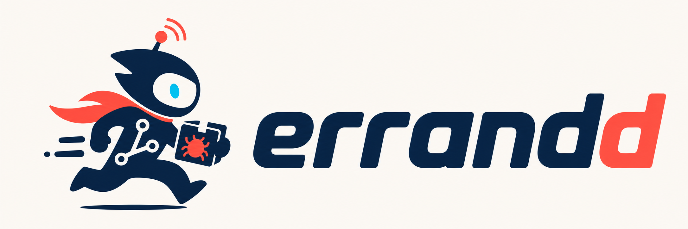

<h1 align="center">
  
</h1>

<p align="center">
  <a href="https://github.com/NorthIsUp/errandd/stargazers">
    
  </a>
  <a href="https://github.com/NorthIsUp/errandd/commits/main">
    
  </a>
  <a href="https://github.com/NorthIsUp/errandd/graphs/contributors">
    
  </a>
</p>

<p align="center"><b>A self-hosted daemon that puts your coding agent on watch — listening to your dev and prod environment and acting on what it sees.</b></p>

Errandd runs a coding-agent CLI — **Claude Code** by default, or [**Pi**](https://pi.dev) — as a background daemon wired into the systems your team already uses. It **listens for events** (GitHub pull requests, Sentry errors, Datadog alerts, Linear issues) and **runs scheduled routines** (morning ticket triage, nightly sweeps, recurring checks). Each event or tick is matched against your **routines** — plain markdown files, version-controlled — and handed to the agent to investigate, triage, or fix. A web dashboard and Telegram/Discord/Slack bridges let you watch and steer it in real time.

It's built on the coding-agent subscription you already pay for — no per-call API bill, no cloud to trust with your source. _(Formerly clawdcode.)_

## How it works

```
GitHub · Sentry · Datadog · Linear ─┐
                                     ├─► match routines ─► enqueue job ─► agent (Claude / Pi) ─► investigate · triage · act
        cron schedule ──────────────┘
```

1. **An event arrives** — a signed webhook from GitHub/Sentry/Datadog/Linear, or a cron tick.
2. **It's matched** against every routine's `on:` triggers.
3. **Matches become durable jobs** on a queue (they survive restarts).
4. **The agent runs the routine** in an isolated session, using the tools your coding-agent CLI already has — reading the diff, querying logs, posting a review, opening a ticket.
5. **You watch and steer** from the dashboard or a chat bridge, and every delivery is recorded so nothing is silently dropped.

## Event sources

Errandd exposes one signed webhook per provider. Each incoming delivery is verified, recorded, and matched against your routines' triggers.

| Source | Endpoint | Auth | Triggers |
| --- | --- | --- | --- |
| **GitHub** | `POST /api/webhooks/github` | HMAC `X-Hub-Signature-256` — `ERRANDD_GITHUB_WEBHOOK_SECRET` | `prs`, `pr`, `comments`, `reviews`, `checks`, `issues` |
| **Sentry** | `POST /api/webhooks/sentry` | HMAC `Sentry-Hook-Signature` — `ERRANDD_SENTRY_CLIENT_SECRET` | `sentry` |
| **Datadog** | `POST /api/webhooks/datadog` | `X-Errandd-Token` / `?token=` — `ERRANDD_DATADOG_WEBHOOK_SECRET` | `datadog` |
| **Linear** | `POST /api/webhooks/linear` | HMAC `Linear-Signature` — `ERRANDD_LINEAR_WEBHOOK_SECRET` | `linear` |

The GitHub receiver understands the real payloads — it parses pull requests, review comments, checks, and issues, skips its own bot activity, honors a `claw:ignore` label, and drops CI noise before it ever reaches the agent. Sentry keeps a first-seen ledger so you're triaged once per issue, not once per event. Datadog ships a recommended payload template you paste into your monitor.

Prefer to push events yourself? `POST /api/inject` runs a one-shot agent message from any script or CI step (bearer/web token, or a static `settings.apiToken`).

## Routines as code

A **routine** is a markdown file describing a task, with an `on:` block declaring what triggers it. Point Errandd at a git repo (`jobsRepo.url` / `ERRANDD_JOBSREPO_URL`) and every top-level `.md` file becomes a routine — cloned on start, pulled on an interval. Your automation lives in version control, reviewed like any other code.

```markdown
---
description: Review new and updated pull requests
on:
  - prs: true
---

Review the pull request diff for bugs, missing tests, and unclear code.
Leave inline review comments where you can be specific, then post a short
summary. Approve only if it's clearly safe.
```

Triggers combine freely — an event, a schedule, or both:

```markdown
---
description: Triage new Sentry issues, and sweep the backlog each morning
on:
  - sentry: true
  - schedule: "0 9 * * 1-5"
---

For each Sentry issue, find the offending code, assess severity and likely
cause, and open a Linear ticket with a proposed fix when it's actionable.
```

`on:` is a list of single-key triggers: `schedule` (a cron string), `prs`, `pr` (with filters), `comments`, `reviews`, `sentry`, `datadog`, `linear`, `checks`, `issues`. Cron schedules are timezone-aware (`ERRANDD_TIMEZONE`). Full trigger syntax lives in [`errandd/docs/PR_HOOKS_SPEC.md`](errandd/docs/PR_HOOKS_SPEC.md).

## Quick start

```bash
claude plugin marketplace add NorthIsUp/errandd
claude plugin install errandd
```

Then open a Claude Code session and run:

```
/errandd:start
```

The setup wizard walks you through the runtime, model, chat surfaces, event webhooks, and security level, then your daemon is live with a web dashboard. Add a jobs repo and your first routines run on the next tick or event.

## Pluggable runtimes

The exec runtime — the process that actually runs your prompts — sits behind one interface and is chosen once at startup:

- **Claude Code** (`claude`) — the default. Session resume, context-token reporting (which drives size-based auto-compaction), jobs-repo plugins/skills, and MCP server management all work.
- **Pi** ([`pi`](https://pi.dev), experimental) — an alternate coding-agent CLI. Errandd drives it with `--mode json -p`, resumes via `--session <id>`, and reads token usage per message so auto-compaction works the same. Pi documents *"No MCP"* by design, so MCP registration is inert and Claude-shaped plugin flags aren't forwarded — features a runtime can't back are switched off gracefully rather than breaking.

Select it with the `runtime` field in `.claude/errandd/settings.json` or the `ERRANDD_RUNTIME` env var (env wins). Both binaries ship in the Docker image, so **switching runtime is a restart, not a rebuild**:

```bash
ERRANDD_RUNTIME=pi docker run ... errandd                        # Docker
helm upgrade errandd errandd/charts/errandd --set runtime=pi     # Helm
```

> Pi's version is **pinned to 0.80.6** (in both `mise.toml` and the `Dockerfile`) because the stream parser is written against the JSON event schema it emits. Bump it deliberately and re-run the e2e suite, which fails if the wire moved. The adapters are covered two ways — a conformance matrix asserting both runtimes normalize to *identical* events, and an opt-in suite driving the real binaries (`cd errandd && ERRANDD_E2E=1 bun test app/__tests__/runtime-e2e.test.ts`).

## Watch and steer

- **Web dashboard** — every delivery, queued job, and run in real time: open a thread to read the agent's reasoning and tool calls, or chat with it directly. Manage routines, inspect logs, retrigger jobs.
- **Telegram / Discord / Slack** — first-class bridges, not just notifications. DMs, channel mentions, threads, slash commands, image attachments, and voice messages (transcribed). Discord threads each get their own isolated agent session that runs in parallel — see [`errandd/docs/MULTI_SESSION.md`](errandd/docs/MULTI_SESSION.md).
- **[AG-UI](https://ag-ui.com) endpoint** — `POST /api/agui` streams a turn as AG-UI SSE events (`RUN_STARTED` → `TEXT_MESSAGE_*` / `TOOL_CALL_*` → `RUN_FINISHED`), runtime-agnostic, for wiring Errandd into your own UI.

```bash
curl -N -X POST http://localhost:4632/api/agui \
  -H "Authorization: Bearer $(cat .claude/errandd/web.token)" \
  -H "Content-Type: application/json" \
  -d '{"prompt": "summarize the failed runs from today"}'
```

## Configuration

`.claude/errandd/settings.json` is the source of truth; every field can be overridden by an `ERRANDD_*` environment variable (env always wins). See `.env.example` for the full list.

| Variable | Overrides |
| --- | --- |
| `ERRANDD_RUNTIME` | Exec runtime: `claude` (default) or `pi` |
| `ERRANDD_MODEL` / `ERRANDD_API` | Primary model and API |
| `ERRANDD_FALLBACK_MODEL` / `ERRANDD_FALLBACK_API` | Fallback model and API |
| `ERRANDD_TIMEZONE` | Timezone (also re-derives the cron offset) |
| `ERRANDD_JOBSREPO_URL` / `ERRANDD_JOBSREPO_BRANCH` / `ERRANDD_JOBSREPO_INTERVAL` | Jobs repo (clone + pull interval, default 300 s) |
| `ERRANDD_JOBSREPOS` | Comma-separated git URLs replacing the whole jobs-repo list |
| `ERRANDD_GITHUB_WEBHOOK_SECRET` | GitHub webhook HMAC secret |
| `ERRANDD_SENTRY_CLIENT_SECRET` | Sentry webhook HMAC secret |
| `ERRANDD_DATADOG_WEBHOOK_SECRET` | Datadog shared token |
| `ERRANDD_LINEAR_WEBHOOK_SECRET` | Linear webhook HMAC secret |
| `ERRANDD_API_TOKEN` | Static token for `POST /api/inject` |
| `ERRANDD_WEB_ENABLED` / `ERRANDD_WEB_HOST` / `ERRANDD_WEB_PORT` | Web dashboard |
| `ERRANDD_SECURITY_LEVEL` | Security level (read-only → full access) |
| `ERRANDD_TELEGRAM_TOKEN` | Telegram bot token (alias: `TELEGRAM_TOKEN`) |
| `ERRANDD_DISCORD_TOKEN` | Discord bot token (alias: `DISCORD_TOKEN`) |
| `ERRANDD_SLACK_BOT_TOKEN` / `ERRANDD_SLACK_APP_TOKEN` | Slack tokens (aliases: `SLACK_BOT_TOKEN`, `SLACK_APP_TOKEN`) |
| `ERRANDD_STT_BASE_URL` / `ERRANDD_STT_MODEL` | Voice transcription backend |

Nested arrays and objects (trigger scopes, agentic modes, allowed user IDs, plugins) are file-only.

## Deployment

### Docker

```bash
docker build -t errandd .
docker run -p 4632:4632 -v $PWD/.claude:/app/.claude --env-file .env errandd
```

- **Both runtimes are baked in** — `claude` and `pi@0.80.6` — defaulting to `claude`. Switch with `-e ERRANDD_RUNTIME=pi`; no rebuild.
- **State persists in the `/app/.claude` volume** (jobs, logs, tokens, session transcripts). The image symlinks `~/.claude` → `/app/.claude` and `~/.pi` → `/app/.claude/pi`, so `--resume`/`--session` survive restarts. Mount a *persistent* volume — an anonymous one resets per container.
- **Health:** a `HEALTHCHECK` polls `/readyz` (503 until startup finishes, 200 when ready). Liveness is `/healthz`.

Claude auth comes from the mounted `.claude` volume (if it holds credentials from a local `claude` login) or a `CLAUDE_CODE_OAUTH_TOKEN` from `claude setup-token`.

### Helm

A chart ships at [`errandd/charts/errandd`](errandd/charts/errandd):

```bash
helm install errandd errandd/charts/errandd
helm upgrade errandd errandd/charts/errandd --set runtime=pi   # switch runtime, same image
```

Key values: `runtime`, `persistence.*` for the `/app/.claude` PVC, `secrets.*`, `ingress.*`, and an `env:` map for arbitrary `ERRANDD_*` overrides. The daemon is single-instance and stateful — the chart keeps `replicaCount: 1` with a `Recreate` strategy.

### Local development

```bash
cd errandd       # the whole project lives here; the repo root is plugin-dist only
mise install     # bun, node, biome, hk — and the pinned pi runtime
mise run setup   # bun install + hk git hooks
bun run start    # run the daemon
```

The web dashboard is a React + TypeScript app (`errandd/web/`) built with Bun's bundler and served from `dist/web/`. Build with `bun run build:web`, watch with `bun run dev:web`. All `/api/*` routes (except health) are gated by a web auth token, auto-generated on first start and written to `.claude/errandd/web.token`.

## Screenshots

### The web dashboard

<p align="center">
  
</p>

_Every incoming event — GitHub PRs, Sentry errors, Datadog alerts, Linear issues — becomes a thread you can open and chat with the agent about._

### Routines

<p align="center">
  
</p>

_Routines sync from your jobs repo and run on a schedule or in response to events — toggle them on and off without touching the files._

### The agent at work

<p align="center">
  
</p>

_A run's detail: streamed reasoning, tool calls, and outcome — here the agent resolves a PR's review threads and posts its replies._

## FAQ

<details open>
  <summary><strong>Do I have to give it production access?</strong></summary>
  <p>
    No. Errandd runs at one of four security levels, from read-only to full system
    access, and sessions are folder-isolated. Start it read-only, watch what it does
    from the dashboard, and widen access only where you want it to act.
  </p>
</details>

<details open>
  <summary><strong>Where do my routines and automation live?</strong></summary>
  <p>
    In a git repo you control — one markdown file per routine, cloned and pulled on
    an interval. Your automation is reviewed, versioned, and diffable like any other
    code, not locked inside a SaaS console.
  </p>
</details>

<details open>
  <summary><strong>Which coding agents does it support?</strong></summary>
  <p>
    Claude Code by default, or Pi (experimental). The runtime is pluggable and chosen
    at startup — both binaries ship in the image, so switching is a restart, not a rebuild.
  </p>
</details>

<details open>
  <summary><strong>Can Errandd do &lt;something&gt;?</strong></summary>
  <p>
    If your coding-agent CLI can do it, Errandd can too. On top it adds event listeners,
    schedules, a durable job queue, and the chat/dashboard surfaces. Teach it new
    skills and workflows the same way you would the CLI.
  </p>
</details>

## Contributing

```bash
cd errandd       # the repo root holds only the plugin; everything else is here
mise install     # pinned toolchain, including pi 0.80.6
mise run setup   # bun install + hk git hooks (pre-commit: eslint + typecheck; pre-push: tests + web build)
```

**Before opening any PR**, bump the plugin metadata — both are required CI guards:

```bash
bun run bump:plugin-version
bun run bump:marketplace-version
```

The `plugin-version-guard` and `marketplace-version-guard` checks fail if `.claude-plugin/plugin.json` or `.claude-plugin/marketplace.json` still carry the merge-base version — commit the bumps alongside your changes and push before creating the PR.
